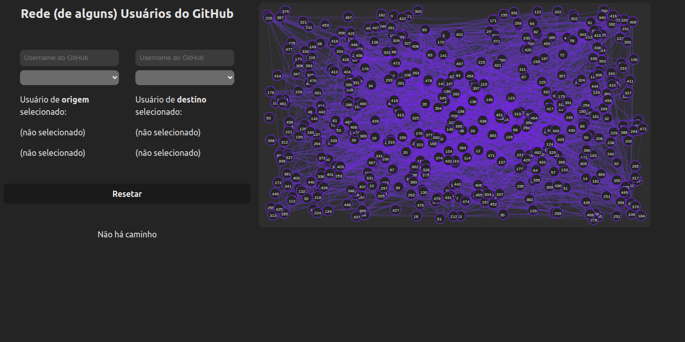
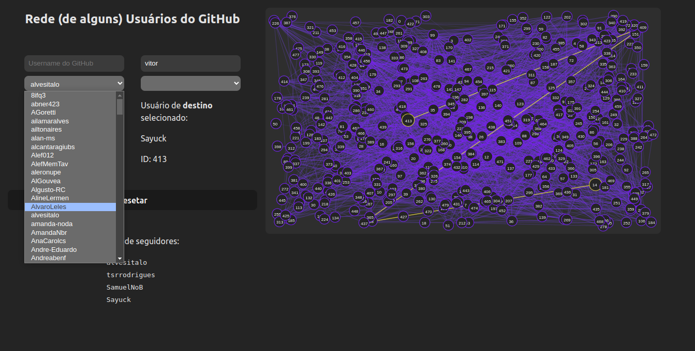
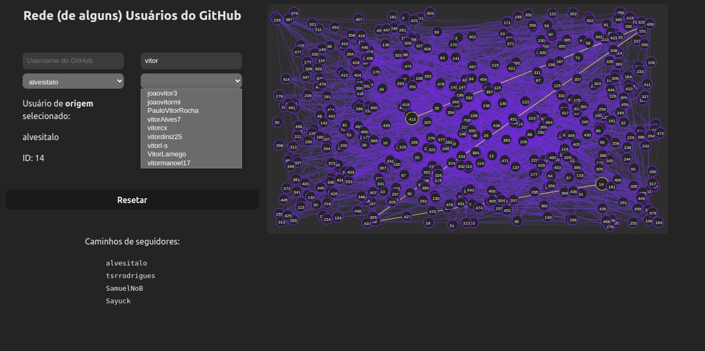
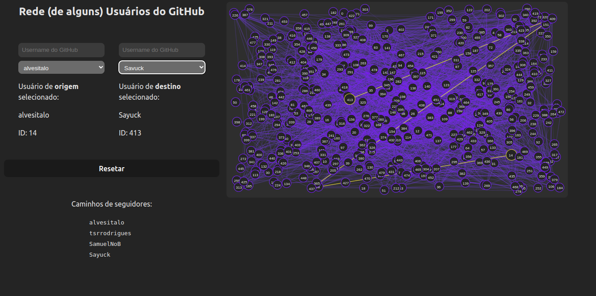

# Rede (de alguns) Usuários do GitHub

**Número da Lista**: 19

**Conteúdo da Disciplina**: Grafos1

## Alunos

| Matrícula  | Aluno                                                       |
| ---------- | ----------------------------------------------------------- |
| 16/0127912 | [João Vitor Ferreira Alves](https://github.com/vitorAlves7) |
| 16/0149410 | [Yudi Yamane de Azevedo](https://github.com/yudi-azvd)      |

## Sobre

Esse app monta um grafo com os usuários membros da organização
[Projetos de Algoritmos](https://github.com/projeto-de-algoritmos) no GitHub.
Cada círculo é um usuário e as linhas representam as relações de seguidos e
seguidores.

> As linhas não possuem direção visualmente, mas as arestas no
> grafo **são** direcionadas.

Você pode escolher dois usuários e o app vai te mostrar o menor caminho que liga
os dois de acordo com os seus seguidores.

---

### Apresentação

O vídeo está em [./pa-0-grafos.mp4](./pa-0-grafos.mp4).

Você também pode assistir a [apresetação](https://youtu.be/hUagdM_plRs)
pelo YouTube.

## Screenshots



Screenshot da tela padrão.



Você pode selecionar um usuário clicando no select.



Você pode filtrar os usuário no campo de texto.



Mostra o caminho entre dois usuários.

## Instalação

**Linguagem**: TypeScript

**Framework**: Svelte

Você precisa do [Node.js](https://nodejs.org/en) versão 16+ e de um gerenciador
de pacotes como
[npm](https://docs.npmjs.com/downloading-and-installing-node-js-and-npm) ou
[pnpm](https://pnpm.io/installation).

Instale as dependências:

```sh
npm i
# ou se você usa pnpm:
pnpm i
```

Inicie o servidor da aplicação:

```sh
npm run dev
# ou
pnpm dev
```

Acesse a aplicação em http://localhost:5173/.

## Uso

Escolha nas caixas de seleção o par de usuário para que você
descubra o caminho de seguidores entre eles.
